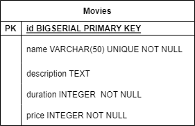
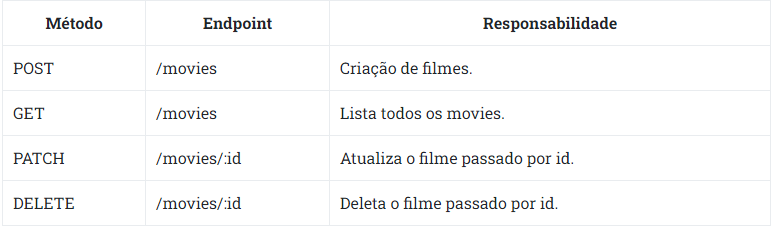

# Movies com TypeORM

Este projeto visa desenvolver uma API Restful completa para uma aplicação de filmes, utilizando o TypeORM para manipular os dados. Através dessa API, os usuários poderão realizar operações de criação, atualização e exclusão de filmes, além de listar todos os filmes cadastrados. O objetivo é fornecer uma solução eficiente e segura para o gerenciamento de dados de uma aplicação de filmes.

#

## Diagramas de entidade relacionamento:



## Iniciando projeto:

Para inciar este projeto, é necessário instalar as dependências, que serão utilizadas nos testes. Portanto utilize o comando abaixo para instalar tais dependências:

```bash
# caso use npm
npm install

# caso use yarn
yarn
```

## Configurando dotenv

**Configure as variáveis de ambiente no seu .env**, passando as credenciais corretas para conectar em seu banco local. Siga o exemplo do arquivo **.env.example**.

## Rodando a aplicação

Com isso feito, para rodar sua aplicação, basta utilizar o comando:

```bash
# caso use npm
npm run dev

# caso use yarn
yarn dev
```

#

## 🚀 Tecnologias Utilizadas

<ul>
    <li>NodeJS</li>
    <li>TypeScript</li>
    <li>Express</li>
    <li>TypeORM</li>
    <li>PostgreSQL</li>
    <li>PG</li>
    <li>Zod (para validação de dados)</li>
    <li>Dotenv</li>
    <li>Jest</li>
    <li>Supertest</li>
</ul>

#

## ⚙ Funcionalidades

<ul>
    <li>Criação de filmes.</li>
    <li>Listar todos os filmes</li>
    <li>Paginação na rota GET </li>
    <li>Atualizar dados do filme</li>
    <li>Deletar filme</li>
    <li>Serialização de dados</li>
</ul>

#

## Endpoints do serviço:

### POST - /movies

<ul>
  <li>Rota para criação de filmes com os seguintes dados:</li>
  <li>name: string </li>
  <li>description: string opcional</li>
  <li>duration: number integer</li>
  <li>price: number integer</li>
</ul>

### GET - /movies

<ul>
    <li>Rota retorna todos os filmes do banco de dados</li>
    <li>Existe uma paginação, onde você pode filtrar pela pagina e quantos filmes deve retornar, além disso pode ser ordenado por crescente ou decrescente</li>
    <h2>Query params: order e sort</h2>
    <ol>
        <li><strong>sort:</strong> recebe qual coluna a ordenação deve ser feita. Pode receber apenas dois valores, sendo eles: price e duration, caso nenhum desses valores seja enviado, ordenará por id.</li>
        <li><strong>order:</strong> recebe qual o tipo de ordenação que será feita. Pode receber apenas dois valores, sendo eles: asc e desc, caso nenhum desses valores seja enviado, deve utilizar asc. O tipo de ordenação só funciona caso sort seja enviado, caso não seja enviado, o tipo deve ser asc.</li>
    </ol>
    <h2>Query params: perPage e page</h2>
    <ol>
        <li><strong>perPage:</strong> recebe qual a quantidade de filmes que devem ser retornados. Recebe apenas números inteiros e maiores que 0, caso o número enviado não atenda esses requisitos, retornará os cinco primeiros dados. O valor máximo à ser retornado é cinco, caso o número enviado seja maior que cinco, retornará cinco dados.</li>
        <li><strong>page:</strong> recebe qual página deve ser mostrada. Recebe apenas números inteiros e maiores que 0, caso o número enviado não atenda esses requisitos, retornará a primeira página. Respeita o perPage, ou seja, se page for igual à três e perPage for igual à dois, deve retornar dois dados, começando pelo id cinco e indo até o id seis.</li>
    </ol>
</ul>

### PATCH - /movies/id

<ul>
    <li>Rota para atualizar um filme pelo ID</li>
</ul>

### DELETE - /movies/id

<ul>
    <li>Rota para deletar um filme pelo ID</li>
</ul>

# Todos endpoints do serviço:



#
## Sobre os testes

Essa aplicação possui testes, que serão utilizados para validar, se todas as regras de negócio foram aplicadas de maneira correta.

Os testes estão localizados em `src/__tests__`.

Na subpasta `integration` estão os testes.

Já na subpasta `mocks` estão os dados que serão utilizados para os testes.

No arquivo `jest.config.ts` estão algumas configurações necessárias para os testes rodarem.

**`De modo algum altere qualquer um desses arquivos.`** Isso poderá comprometer a integridade dos testes.

E também não altere o script de `test` localizado no `package.json`. Isso será utilizado para rodar os testes.

## Rodando os testes

Para rodar os testes é necessário que no seu terminal, você esteja dentro do diretório do projeto.

Estando no terminal e dentro do caminho correto, você poderá utilizar os comandos a seguir:

### Rodar todos os testes

```bash
# caso use npm
npm run test

# caso use yarn
yarn test
```

### Rodar os testes de uma pasta específica

> detalhe: repare que tests está envolvido por 2 underlines. Isso se chama ***dunder***.

```bash
# caso use npm
npm run test <subpasta>

# caso use yarn
yarn test <subpasta>
```

### Rodar os testes de um arquivo específico

```bash
# caso use npm
npm run test <subpasta>/<arquivo>

# caso use yarn
yarn test <subpasta>/<arquivo>
```

**Caso você queira verificar todas as opções de execução de testes, visite a [Documentação oficial do Jest](https://jestjs.io/docs/cli)**

Após rodar um dos comandos aparecerá um log no seu terminal, contendo as informações da execução do teste.

**Observação:** O teste pode demorar alguns segundos para ser finalizado. Quanto maior for o teste, mais tempo será consumido para a execução.

#

<a href="https://www.linkedin.com/in/hericlessouza/" target="_blank"></a>
  <a href="mailto:hericlessouza01@gmail.com" target="_blank"></a>
  <a href="https://wa.me/5511961383545" target="_blank"></a>
  <a href="https://portfolio-murex-six-65.vercel.app/" target="_blank"></a>